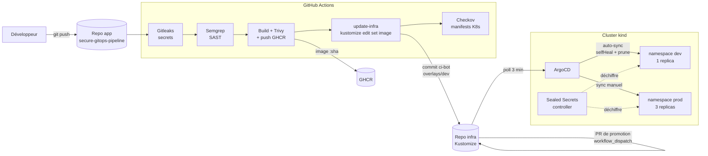

# secure-gitops-pipeline

Pipeline **GitOps sécurisé** de bout en bout : un commit sur le code applicatif déclenche automatiquement le build, les scans de sécurité, la publication de l'image, la mise à jour des manifests Kubernetes, puis le déploiement par **ArgoCD**. La promotion vers la production passe par une **Pull Request** et une synchronisation manuelle.

Projet de portfolio DevSecOps, entièrement exécutable en local (kind) pour un coût proche de 0 €.

---

## Sommaire

1. [Architecture](#architecture)
2. [Stack technique](#stack-technique)
3. [Les deux repositories](#les-deux-repositories)
4. [Pipeline CI/CD](#pipeline-cicd)
5. [Sécurité](#sécurité)
6. [Promotion dev → prod](#promotion-dev--prod)
7. [Gestion des secrets](#gestion-des-secrets)
8. [Tests de résilience](#tests-de-résilience)
9. [Reproduire le projet](#reproduire-le-projet)
10. [Choix assumés et limites](#choix-assumés-et-limites)
11. [Incidents et leçons retenues](#incidents-et-leçons-retenues)
12. [Pistes d'amélioration](#pistes-damélioration)

---

## Architecture



**Principe directeur** : Git est l'unique source de vérité. Le cluster ne reçoit jamais de `kubectl apply` manuel pour l'application, ArgoCD réconcilie en continu l'état déclaré dans le repo infra.

---

## Stack technique

| Domaine | Outil | Rôle |
|---|---|---|
| Application | Flask + gunicorn | API de démonstration (`/`, `/health`, `/ready`, `/info`) |
| CI | GitHub Actions | Build, scans, publication, mise à jour de l'infra |
| Registre | GHCR | Images taguées par SHA court du commit (jamais `latest`) |
| Scan de secrets | Gitleaks | Détection de credentials dans l'historique Git |
| SAST | Semgrep | Analyse statique du code |
| Scan d'image | Trivy | CVE de l'OS et des dépendances (bloque sur HIGH/CRITICAL) |
| Scan de manifests | Checkov | Bonnes pratiques Kubernetes sur le manifest **résolu** |
| Manifests | Kustomize | `base/` + `overlays/dev` + `overlays/prod` |
| GitOps | ArgoCD v3.5.3 | Synchronisation continue Git → cluster |
| Secrets | Sealed Secrets (Bitnami) v0.27.1 | Secrets chiffrés dans Git |
| Cluster | kind (Kubernetes v1.34) | Cluster local, gratuit |

---

## Les deux repositories

Séparation volontaire entre le code applicatif et la configuration de déploiement.

### `secure-gitops-pipeline` (application)

```
secure-gitops-pipeline/
├── app.py                      API Flask
├── Dockerfile                  multi-stage, non-root, HEALTHCHECK
├── requirements.txt
├── requirements-dev.txt
├── docker-compose.yml          exécution locale hors cluster
├── tests/test_app.py           tests unitaires
└── .github/workflows/ci.yaml   pipeline en 5 jobs
```

### `secure-gitops-pipeline-infra` (manifests)

```
secure-gitops-pipeline-infra/
├── base/
│   ├── deployment.yaml         manifest commun, image générique "myapp"
│   ├── service.yaml
│   └── kustomization.yaml
├── overlays/
│   ├── dev/                    1 replica, tag mis à jour par le CI
│   │   ├── kustomization.yaml
│   │   ├── patch-replicas.yaml
│   │   └── sealed-secret-app.yaml
│   └── prod/                   3 replicas, ressources renforcées, tag promu par PR
│       ├── kustomization.yaml
│       ├── patch-replicas.yaml
│       ├── patch-resources.yaml
│       └── sealed-secret-app.yaml
├── argocd/
│   ├── application-dev.yaml    auto-sync + selfHeal + prune
│   └── application-prod.yaml   synchronisation manuelle
└── .github/workflows/promote-to-prod.yml
```

---

## Pipeline CI/CD

Déclenché à chaque push sur `main` du repo applicatif (hors `README.md` et `docs/**`).

| # | Job | Outil | Bloque si |
|---|---|---|---|
| 1 | `secrets-scan` | Gitleaks | un secret est détecté dans l'historique |
| 2 | `sast-scan` | Semgrep | un finding de sécurité est détecté |
| 3 | `build-scan-push` | Docker Buildx + Trivy | vulnérabilité HIGH/CRITICAL corrigeable. L'image n'est **poussée qu'après** un scan propre |
| 4 | `update-infra` | Kustomize | exécute `kustomize edit set image` sur `overlays/dev` et pousse un commit `ci-bot` |
| 5 | `scan-manifests` | Checkov | un check Kubernetes échoue sur `kustomize build overlays/dev` |

Points notables :

- **Le tag d'image est le SHA court du commit.** `latest` est mutable et empêcherait ArgoCD de détecter fiablement un changement.
- **Checkov scanne la sortie de `kustomize build`**, pas les fichiers `base/` bruts : les patches d'overlay peuvent introduire des non-conformités qu'un scan de la base ne verrait pas.
- **`trivy-action` est épinglé sur `v0.36.0`** suite à l'attaque de la chaîne d'approvisionnement de mars 2026 (76 tags sur 77 compromis).
- Le job `update-infra` utilise un PAT *fine-grained* limité au seul repo infra (Contents : Read/Write), stocké dans le secret `REPO_INFRA`.

---

## Sécurité

### Image et conteneur

- Build multi-stage, image finale minimale
- Mise à jour des paquets système au build (`apt-get upgrade`) et `pull: true` en CI, pour ne pas hériter d'une image de base obsolète
- Utilisateur non-root, UID numérique `10001`
- Serveur de dev Flask limité à `127.0.0.1`, gunicorn en production

### Manifests Kubernetes

Définis dans `base/deployment.yaml` et donc hérités par dev et prod :

```yaml
automountServiceAccountToken: false
securityContext:                       # pod
  runAsNonRoot: true
  runAsUser: 10001
containers:
  - imagePullPolicy: Always
    securityContext:                   # conteneur
      allowPrivilegeEscalation: false
      capabilities: { drop: ["ALL"] }
      seccompProfile: { type: RuntimeDefault }
    resources: { requests: ..., limits: ... }
    livenessProbe / readinessProbe: ...
```

### Résultat Checkov

**87 checks passés, 0 échec** sur `kustomize build overlays/dev`, avec 3 exceptions explicitement documentées (voir [Choix assumés](#choix-assumés-et-limites)).

Le job utilise `skip_check` plutôt que `soft_fail` : toute **nouvelle** régression continue de faire échouer le CI, et les exceptions sont des décisions tracées, pas des angles morts.

---

## Promotion dev → prod

La production n'est **jamais** mise à jour automatiquement par le CI.

1. Le CI met à jour `overlays/dev` automatiquement (commit `ci-bot`) et ArgoCD déploie en dev.
2. Une fois le tag validé en dev, un humain lance le workflow **Promote dev to prod (PR)** (`workflow_dispatch`).
3. Le workflow lit le tag de `overlays/dev`, l'applique à `overlays/prod`, vérifie que le manifest se construit, puis **ouvre une Pull Request** ne modifiant que la ligne `newTag`.
4. Après revue et merge de la PR, l'Application ArgoCD `secure-gitops-pipeline-prod` passe `OutOfSync`.
5. Un humain déclenche le **Sync manuel** dans ArgoCD. C'est une seconde validation avant tout changement en production.

| | dev | prod |
|---|---|---|
| Replicas | 1 | 3 |
| Mise à jour du tag | automatique (CI) | Pull Request |
| Synchronisation ArgoCD | automatique, `selfHeal`, `prune` | manuelle |

> **Attention** : `base/` étant partagé, toute modification de `base/` faite pour dev doit être explicitement promue vers prod. Prod diverge sinon silencieusement, puisqu'elle ne se synchronise pas seule.

---

## Gestion des secrets

Aucun secret n'est jamais en clair dans Git.

- **Sealed Secrets** : le contrôleur du cluster détient la clé privée ; seul le `SealedSecret` chiffré est commité.
- Un secret par environnement, avec des **valeurs distinctes** en dev et en prod.
- Le chiffrement est lié au couple *(nom, namespace)* : un `SealedSecret` chiffré pour dev ne peut pas être déchiffré en prod.
- Le secret est **monté en fichier** (`/etc/secrets/API_KEY`, lecture seule) et non injecté en variable d'environnement. Une variable d'environnement apparaît dans `kubectl describe pod`, dans certains dumps de crash et dans des outils d'observabilité qui journalisent l'environnement du conteneur. C'est ce que recommande le check Checkov `CKV_K8S_35`.
- L'application n'expose **jamais** la valeur : `/info` retourne uniquement `"api_key_loaded": true`.

Création d'un secret :

```bash
kubectl create secret generic app-secret \
  --namespace secure-gitops-pipeline-dev \
  --from-literal=API_KEY=<valeur> \
  --dry-run=client -o yaml \
| kubeseal --format=yaml > overlays/dev/sealed-secret-app.yaml
```

> Le fichier `Secret` en clair ne doit jamais être commité. Il n'existe que le temps de la commande.

---

## Tests de résilience

### Rollback (`git revert`)

Un commit de test sur le repo app a produit une nouvelle image et un commit `ci-bot` sur l'overlay dev. Un `git revert` de ce commit a fait revenir ArgoCD au tag précédent, sans aucune action sur le cluster. Le rollback est donc un simple commit Git, tracé et auditable.

### Détection et correction de drift

`kubectl scale --replicas=3` sur le Deployment dev crée un écart avec Git.

- Avec `selfHeal: true`, ArgoCD supprime les pods en trop en moins de 3 secondes.
- Pour rendre l'écart visible en démonstration, `selfHeal` est désactivé temporairement : l'Application passe `OutOfSync`, puis la réactivation provoque la correction automatique et le retour à `Synced`.

### Test négatif du pipeline

Le job Trivy a bloqué une **vraie** CVE HIGH (`libpcre2-8-0`, paquet de l'image de base Debian), qui a été corrigée par la mise à jour des paquets système au build.

---

## Reproduire le projet

### Prérequis

Docker, `kind`, `kubectl`, `kustomize`, `kubeseal`, un compte GitHub.

### 1. Cluster et ArgoCD

```bash
kind create cluster --name gitops-demo

kubectl create namespace argocd
kubectl apply -n argocd --server-side --force-conflicts \
  -f https://raw.githubusercontent.com/argoproj/argo-cd/stable/manifests/install.yaml

kubectl get crds | grep argoproj        # 3 CRD attendues
kubectl get pods -n argocd              # tous Running
```

> `--server-side --force-conflicts` est nécessaire : le CRD `applicationsets` dépasse la limite de taille des annotations en mode client-side.

### 2. Sealed Secrets

```bash
kubectl apply -f https://github.com/bitnami-labs/sealed-secrets/releases/download/v0.27.1/controller.yaml
kubectl get pods -n kube-system | grep sealed-secrets
```

Les `SealedSecret` du repo ne sont déchiffrables que par le cluster qui a généré la clé. Sur un nouveau cluster, il faut **regénérer** les secrets avec `kubeseal`.

### 3. Secrets GitHub Actions (repo app)

| Secret | Contenu |
|---|---|
| `REPO_INFRA` | PAT fine-grained, Contents Read/Write, limité au repo infra |

### 4. Connecter ArgoCD

```bash
kubectl apply -f argocd/application-dev.yaml
kubectl apply -f argocd/application-prod.yaml
kubectl get application -n argocd
```

### 5. Accéder à l'interface

```bash
kubectl -n argocd get secret argocd-initial-admin-secret \
  -o jsonpath="{.data.password}" | base64 -d; echo
kubectl port-forward svc/argocd-server -n argocd 8080:443
# https://localhost:8080  (utilisateur : admin)
```

### 6. Vérifier le déploiement

```bash
kubectl port-forward svc/secure-gitops-pipeline -n secure-gitops-pipeline-dev 8081:80
curl localhost:8081/health
curl localhost:8081/info
```

---

## Choix assumés et limites

### Findings Checkov différés

Trois checks sont exclus via `skip_check`, chacun pour une raison précise.

| Check | Sujet | Raison |
|---|---|---|
| `CKV_K8S_43` | Image référencée par digest | Exigerait de résoudre et pousser un digest SHA256 dans `update-infra` : refonte du CI disproportionnée ici. Le tag SHA du commit garantit déjà l'immutabilité pratique |
| `CKV_K8S_22` | Système de fichiers racine en lecture seule | Gunicorn peut écrire dans `/tmp` : nécessiterait un `emptyDir` dédié et des tests de compatibilité |
| `CKV2_K8S_6` | Absence de `NetworkPolicy` | Ressource à part entière, listée en amélioration |

À l'inverse, `CKV_K8S_35` (secret en variable d'environnement) a été **corrigé et non différé**, car il touchait directement à la gestion des secrets.

### Choix d'architecture

- **kind plutôt que K3s** : même rôle (cluster léger, gratuit, local) pour ce projet.
- **Sealed Secrets plutôt que SOPS + age** : un contrôleur dans le cluster déchiffre automatiquement, sans plugin à greffer sur `argocd-repo-server`. SOPS est plus portable mais son intégration à ArgoCD alourdit un composant déjà sensible en environnement local.
- **Polling ArgoCD (3 min) plutôt que webhook** : un webhook GitHub exigerait d'exposer le cluster local.
- **Synchronisation manuelle en prod** : choix de conception, pas une omission.

### Limites connues

- **Réglages manuels non versionnés sur `argocd-repo-server`** : sous WSL2, ce composant a nécessité des ressources garanties (`requests`/`limits`) et une liveness probe élargie, appliquées par `kubectl patch`. Ils sont perdus si `install.yaml` est réappliqué ou si le cluster est recréé. À transformer en patch Kustomize permanent sur l'installation d'ArgoCD.
- **Les secrets du dépôt sont des valeurs de démonstration.**
- L'application ne distingue pas dev et prod dans ses réponses (`"version": "dev"` est une valeur par défaut codée en dur).

---

## Incidents et leçons retenues

Le projet a été mené avec un journal des incidents réels, chacun avec sa cause et sa correction. Les plus instructifs :

| Incident | Cause racine | Leçon |
|---|---|---|
| `ImagePullBackOff` sur `:latest` malgré un tag dans l'overlay | `base/` contenait aussi un bloc `images:` qui renommait `myapp` avant l'overlay | Ne jamais déclarer `images:` à la fois dans `base/` et dans les overlays. Valider avec `kustomize build ... \| grep image:` |
| `CreateContainerConfigError` | `runAsNonRoot` avec `USER app` (nom non numérique) | Kubernetes ne peut pas vérifier qu'un nom d'utilisateur est non-root : UID numérique obligatoire |
| `argocd-repo-server` en boucle de redémarrages | Pas un crash : le kubelet tuait le pod sur échec de la liveness probe. Cause racine : QoS `BestEffort` sous pression mémoire | Face à des `Liveness probe failed`, vérifier la QoS Class avant d'élargir les seuils |
| Workflow CI jamais déclenché par `git commit --allow-empty` | `paths-ignore` + commit sans fichier modifié | Tester un déclenchement avec un vrai fichier modifié |
| `git push` rejeté sur le repo infra | Le bot CI avait poussé entre-temps | `git pull --rebase` avant de modifier un repo alimenté par un bot |
| Rechute du repo-server après plusieurs jours | Fatigue du nœud kind après 7 jours d'uptime | Redémarrer le conteneur du nœud avant d'empiler des patchs |
| CVE HIGH sur l'image | Paquet système obsolète dans l'image de base | Un scan d'image en CI est un signal continu, pas un contrôle ponctuel |

---

## Pistes d'amélioration

- Patch Kustomize permanent pour la configuration d'`argocd-repo-server`
- `NetworkPolicy` (deny-all par défaut, puis flux explicites)
- `readOnlyRootFilesystem` avec `emptyDir` sur `/tmp`
- Référencement de l'image par digest
- Webhook GitHub → ArgoCD pour une synchronisation quasi instantanée
- `ApplicationSet` pour générer les Applications dev/prod à partir d'un modèle
- Argo Rollouts pour du déploiement canary ou blue-green
- Politique d'admission (OPA Gatekeeper ou Kyverno)

---

## Captures de démonstration

> À ajouter dans `docs/screenshots/` puis à référencer ici.

- Pipeline CI complet (5 jobs verts)
- ArgoCD : applications dev et prod `Synced` / `Healthy`
- Démonstration de drift : `OutOfSync`, puis retour à `Synced`
- Rollback par `git revert`
- Pull Request de promotion (diff d'une seule ligne)
- Rapport Checkov : 87 checks passés